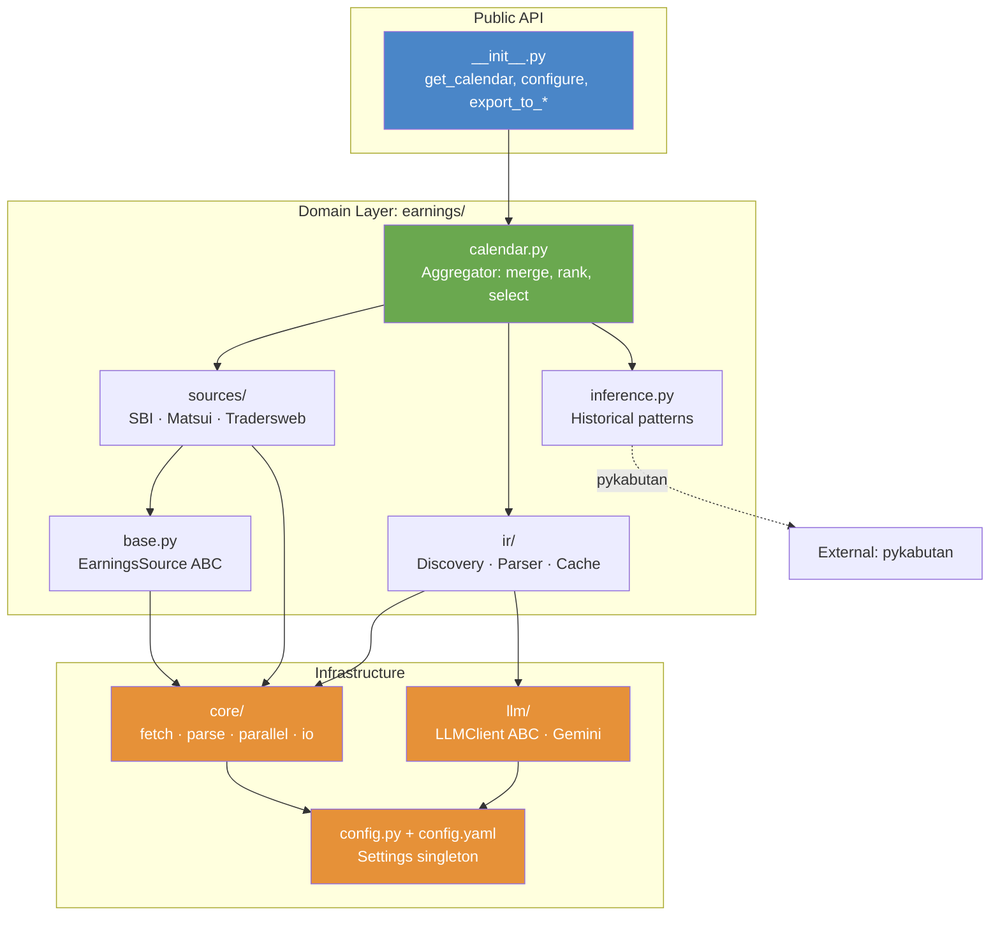
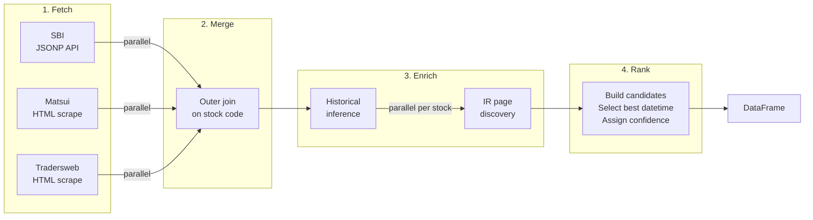
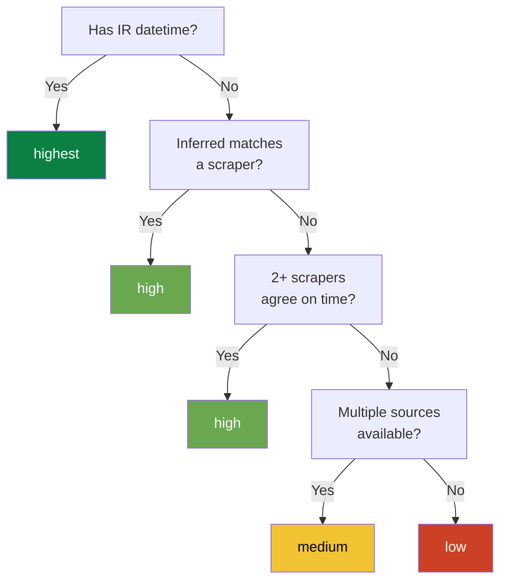
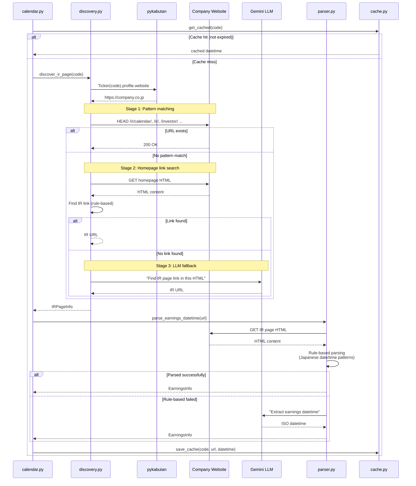
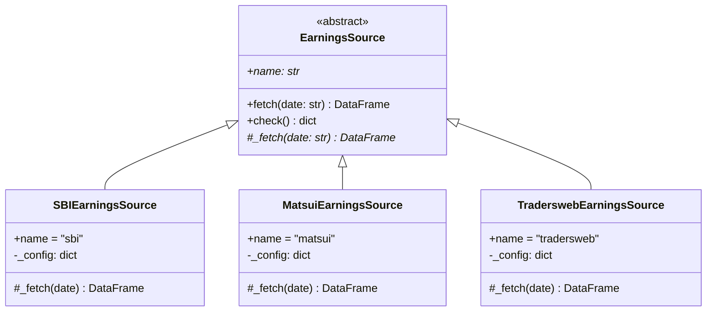

# Architecture

This page describes the internal architecture of pykabu-calendar: how data flows through the system, how modules depend on each other, and how IR discovery works.

## Module Layers

The codebase follows a strict three-layer architecture. High-level modules depend on low-level ones, never the reverse.



**Key rules:**

- `core/` never imports from `earnings/` or `llm/`
- `earnings/` never imports from `llm/` directly (only `ir/` does, for fallback)
- `config.py` is imported by everything but imports nothing from the project
- `llm/` is optional — the system works without it (rule-based only)

## Data Flow

When you call `get_calendar("2026-02-10")`, here's what happens:



### Step-by-step

| Step | Function | What happens |
|------|----------|--------------|
| **1. Fetch** | `run_parallel(tasks)` | All sources fetched concurrently via `ThreadPoolExecutor` |
| **2. Merge** | `_merge_sources()` | Outer join on `code` column, each source gets a `{name}_datetime` column |
| **3a. History** | `_add_history()` | For each stock, fetch past earnings times via pykabutan and infer most likely time |
| **3b. IR** | `_add_ir()` | For each stock, discover IR page and parse announcement datetime (cached) |
| **4. Rank** | `_build_candidates()` | Apply priority rules, build candidate list, assign confidence level |

### Confidence Levels



## IR Discovery Pipeline

The IR discovery module finds company investor relations pages through a 3-stage fallback chain:



## Source Implementation Pattern

Each scraper follows the same pattern: a Python file for logic + a YAML file for configuration.



**Convention:** The YAML file has the same stem as the Python file (`sbi.py` + `sbi.yaml`). YAML contains URLs, CSS selectors, regex patterns, and health check config. Python contains fetch/parse logic.

## File Map

```
src/pykabu_calendar/           # ~2,300 lines total
├── __init__.py                # Public API re-exports
├── config.py                  # Settings dataclass + configure()
├── config.yaml                # Default values (timeout, LLM params, etc.)
├── core/                      # Reusable infrastructure (325 lines)
│   ├── fetch.py               # HTTP: fetch(), fetch_safe(), get_session()
│   ├── parse.py               # HTML→DataFrame: parse_table(), combine_datetime()
│   ├── parallel.py            # run_parallel() — ThreadPoolExecutor wrapper
│   └── io.py                  # Export: CSV, Parquet, SQLite
├── earnings/                  # Domain logic (1,505 lines)
│   ├── base.py                # EarningsSource ABC + load_config()
│   ├── calendar.py            # get_calendar() — merge, enrich, rank
│   ├── inference.py           # Historical pattern inference via pykabutan
│   ├── sources/               # Scraper implementations
│   │   ├── sbi.py + .yaml    # SBI Securities (JSONP API)
│   │   ├── matsui.py + .yaml # Matsui Securities (HTML + pagination)
│   │   └── tradersweb.py + .yaml  # Tradersweb (HTML single-page)
│   └── ir/                    # Company IR page discovery
│       ├── discovery.py       # 3-stage fallback: pattern → homepage → LLM
│       ├── parser.py          # Japanese date/time extraction (rule → LLM)
│       ├── patterns.py        # IR URL patterns + keyword lists
│       └── cache.py           # Thread-safe JSON cache (~/.pykabu_calendar/)
└── llm/                       # Optional LLM layer (328 lines)
    ├── base.py                # LLMClient ABC + find_link/extract_datetime
    └── gemini.py              # Google Gemini free tier implementation
```
